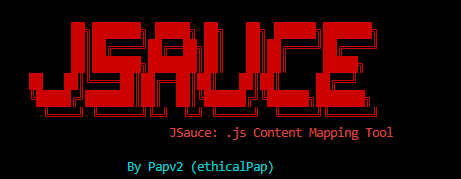

<div align="center">
  
</div>


# JSauce - JavaScript Content Parser

A Python tool for discovering and extracting contents and patterns (via templates) from JavaScript files found on websites. 

## Features

- **Automated JS Discovery**: Intelligently extracts JavaScript file URLs from target websites
- **Pattern Matching**: Uses YAML-based regex templates for content discovery
- **Security-Focused Categories**: Organizes findings into 40+ categories including:
  - API endpoints and authentication systems
  - Payment processing and admin interfaces  
  - API keys, tokens, and sensitive credentials
  - Cloud services and external integrations
  - Framework-specific patterns and debug endpoints
- **Multiple Output Formats**: Generates TXT, JSON, and visual Mermaid flowcharts
- **Visual Reporting**: Creates flowchart diagrams showing content relationships
- **Domain-Aware Processing**: Handles multiple domains with organized output structure
- **Prioritized Results**: Focuses on high-impact security findings first
- **Single URL Support**: Process individual URLs without creating input files
- **Verbose Logging**: Multiple verbosity levels for debugging and monitoring

## Prerequisites

- Python 3.6+
- pip package manager
- Mermaid CLI for diagram rendering (optional but recommended)

## Installation

### Quick Setup
```bash
# Clone the repository
git clone https://github.com/ethicalPap/jsauce.git
cd jsauce

# Install Python dependencies
pip install .

# Install Mermaid CLI for diagram generation (optional but recommended)
npm install -g @mermaid-js/mermaid-cli

# Verify Mermaid installation (optional but recommended)
mmdc --version
```

## Usage

### Basic Usage

**Process a single URL:**
```bash
python3 jsauce.py -u example.com
```

**Process multiple URLs from file:**
```bash
python3 jsauce.py -i input_file.txt 
```

**Use specific templates:**
```bash
python3 jsauce.py -u example.com -t api/
python3 jsauce.py -i targets.txt -t admin/
```

**Enable verbose logging:**
```bash
python3 jsauce.py -u example.com -v    # Basic verbose
python3 jsauce.py -u example.com -vv   # More verbose  
python3 jsauce.py -u example.com -vvv  # Debug level
```

### Input File Format
Create a text file with one URL per line:
```
https://example.com
https://target-site.com
subdomain.example.org
walmart.com
facebook.com
```

### Example Workflows

**Single URL Analysis:**
```bash
# All templates discovery
python3 jsauce.py -u https://facebook.com -t

# Security-focused analysis
python3 jsauce.py -u https://app.starbucks.com -t security/ -v

# Custom template
python3 jsauce.py -u https://example.com -t templates/custom/my_template.yaml
```

**Bulk Analysis:**
```bash
# Create your target list
echo -e "https://facebook.com\nhttps://walmart.com" > targets.txt

# Run different template types
python3 jsauce.py -i targets.txt -t api/
python3 jsauce.py -i targets.txt -t security/
python3 jsauce.py -i targets.txt -t custom_templates/

# View results
ls output/facebook.com/
# facebook.com_endpoints_found.txt
# facebook.com_endpoints_detailed.json
# facebook.com_flowchart.svg
# facebook.com_flowchart.png
```

## Command Line Options

```
Usage:
  python3 jsauce.py -i <inputfile>.txt -t <template> 
  python3 jsauce.py -u <single_url> -t <template>

Required (choose one):
  -i, --input FILE      Text file containing URLs to scan (one URL per line)
  -u, --url URL         Single URL to scan

Optional:
  -t, --template TYPE   Template to use: endpoints, security, custom (default: endpoints)
  -tf, --templatefile   Path to custom YAML template file
  -v, --verbose         Increase verbosity (-v, -vv, -vvv for more detail)
  -h, --help           Show help message

Examples:
  python3 jsauce.py -u https://example.com -t endpoints
  python3 jsauce.py -i url_list.txt -t security -v
  python3 jsauce.py -u facebook.com -tf custom.yaml -vv
```

## Output Files

JSauce generates results in the `./output/{domain}/` directory:

### 1. Quick Reference
- `{domain}_{template}_found.txt` - Clean list of all discovered endpoints

### 2. Detailed Analysis
- `{domain}_{template}_detailed.json` - Complete results with source tracking and categorization
- `{domain}_{template}_for_db.json` - Flat structure optimized for database import
- `{domain}_{template}_stats.json` - Summary statistics and category breakdowns

### 3. Visual Reports
- `{domain}_{template}_flowchart.mmd` - Mermaid diagram source
- `{domain}_{template}_flowchart.svg` - Vector graphic flowchart
- `{domain}_{template}_flowchart.png` - Raster image flowchart

## Templates

JSauce includes two main template categories:

### Endpoints Template (`-t endpoints`)
Focuses on discovering API endpoints and URL patterns:
- API endpoints and versioning
- Authentication and user management
- File operations and content management
- Framework-specific patterns
- External API integrations

### Security Template (`-t security`)
Focuses on security vulnerabilities and sensitive data:
- XSS and injection sinks
- Authentication bypass patterns
- Sensitive data exposure
- Weak cryptography usage
- Security misconfigurations

## Security Categories

JSauce categorizes findings into security-focused groups:

| Category | Security Impact | Examples |
|----------|----------------|----------|
| **admin_endpoints** | Critical | `/admin/`, `/dashboard/`, `/config/` |
| **authentication_endpoints** | Critical | `/login`, `/oauth/`, `/sso/` |
| **api_keys_tokens** | Critical | API keys, JWT tokens, AWS credentials |
| **payment_endpoints** | Critical | `/checkout/`, `/stripe/`, `/billing/` |
| **security_endpoints** | High | `/2fa/`, `/password/`, `/verify/` |
| **api_endpoints** | High | `/api/v1/`, `/rest/`, `/graphql/` |
| **user_management** | High | `/users/`, `/profile/`, `/roles/` |
| **external_apis** | Medium | Third-party API integrations |
| **websockets** | Medium | Real-time communication endpoints |
| **file_operations** | Medium | `/upload/`, `/download/`, file handling |

## Configuration

### Template Customization
Create custom templates in YAML format:

```yaml
custom_endpoints:
  description: "My custom endpoint patterns"
  flags: "gi"
  patterns:
    - "[\\'\"``](/my-api/[\\w\\d/-_.?=&%]+)[\\'\"``]"
    - "[\\'\"``](/custom/[\\w\\d/-_.?=&%]+)[\\'\"``]"

sensitive_data:
  description: "Sensitive information patterns"
  flags: "gi"
  sensitive: true
  patterns:
    - "[\\'\"``]secret[\\'\"``]\\s*:\\s*[\\'\"``]([^'\"``]+)[\\'\"``]"
```

### Settings
Modify `src/config.py` for custom behavior:

```python
# Timeout for web requests (seconds)
REQUEST_TIMEOUT = 10

# Output directory
OUTPUT_DIR = "./output"

# Template directories
TEMPLATES = "./templates"
```

## Architecture

### Core Components
- **`jsauce.py`** - Main entry point and orchestration
- **`CategoryProcessor`** - Pattern matching and categorization engine
- **`JsProcessor`** - JavaScript file extraction and analysis
- **`WebRequests`** - HTTP client with error handling and retry logic
- **`MermaidConverter`** - Visual diagram generation
- **`DomainHandler`** - URL parsing and domain management
- **`ArgumentHandler`** - Command line argument processing
- **`Logger`** - Verbose logging and debugging support

### Processing Pipeline
1. **URL Input** - Parse and validate target URLs (single or file)
2. **HTML Fetch** - Download main page content with user-agent rotation
3. **JS Discovery** - Extract JavaScript file references from HTML
4. **JS Analysis** - Download and analyze each JavaScript file
5. **Pattern Matching** - Apply YAML templates to find endpoints/vulnerabilities
6. **Categorization** - Organize results by security impact and type
7. **Output Generation** - Create multiple report formats (TXT, JSON)
8. **Visualization** - Generate Mermaid flowcharts and render to SVG/PNG

## Security & Ethics

**Important Security Notice:**

JSauce is intended for **authorized security testing only**. Always ensure you have:

- Explicit written permission to test target systems
- Compliance with applicable laws and regulations
- Respect for rate limiting and server resources
- Adherence to responsible disclosure practices

**Recommended Usage:**
- Bug bounty programs with explicit scope
- Internal security assessments
- Red team exercises with proper authorization
- Academic research with appropriate permissions

## Troubleshooting

### Common Issues

**No JavaScript files found:**
```bash
# Check if target uses JS and is accessible
curl -I https://target.com
# Verify no redirect issues or authentication requirements
```

**Empty endpoint results:**
```bash
# Verify template file exists and is valid
python -c "import yaml; yaml.safe_load(open('templates/endpoints/Endpoints.yaml'))"
# Test with verbose mode to see processing details
python3 jsauce.py -u https://example.com -vv
```

**Mermaid diagrams not generating:**
```bash
# Install Mermaid CLI
npm install -g @mermaid-js/mermaid-cli
# Verify installation
mmdc --version
# Check for diagram generation errors in verbose mode
python3 jsauce.py -u https://example.com -v
```

**Connection timeouts:**
```python
# Increase timeout in src/config.py
REQUEST_TIMEOUT = 30
```

**Permission denied errors:**
```bash
# Ensure proper permissions for output directory
chmod 755 output/
# Run with elevated permissions if needed
sudo python3 jsauce.py -u https://example.com
```

### Debug Mode
Enable verbose output for debugging:

```bash
# Basic verbose - shows main processing steps
python3 jsauce.py -u https://example.com -v

# More verbose - shows detailed HTTP requests and pattern matching
python3 jsauce.py -u https://example.com -vv

# Debug level - shows all internal processing details
python3 jsauce.py -u https://example.com -vvv
```

## Sample Output

```
         ██╗███████╗ █████╗ ██╗   ██╗ ██████╗███████╗
         ██║██╔════╝██╔══██╗██║   ██║██╔════╝██╔════╝
         ██║███████╗███████║██║   ██║██║     █████╗  
   ██   ██║╚════██║██╔══██║██║   ██║██║     ██╔══╝  
   ╚█████╔╝███████║██║  ██║╚██████╔╝╚██████╗███████╗
     ╚════╝ ╚══════╝╚═╝  ╚═╝ ╚═════╝  ╚═════╝╚══════╝
                       JSauce: .js Content Mapping Tool
================================================================================
[23:45:12] • Processing single URL: https://app.starbucks.com
[23:45:13] ✓ Found 11 JavaScript files in app.starbucks.com
[23:45:15] ✓ Found endpoints in shared.96f751177f25d4cbdab6.js
[23:45:16] ✓ Saved 28 endpoints for app.starbucks.com
[23:45:17] ✓ Analysis files saved for app.starbucks.com
[23:45:18] ✓ Successfully rendered SVG: flowchart.svg (2.1 MB)
================================================================================
ALL PROCESSING COMPLETED!
================================================================================
```

## Contributing

### Adding New Patterns
1. Fork the repository
2. Edit template files in `templates/endpoints/` or `templates/security/`
3. Add new categories or patterns:
```yaml
new_category:
  description: "Description of what this finds"
  flags: "gi"
  patterns:
    - "your-regex-pattern-here"
```
4. Test with various websites
5. Submit a pull request

### Development Setup
```bash
# Clone your fork
git clone https://github.com/yourusername/jsauce.git
cd jsauce

# Create development branch
git checkout -b feature/new-patterns

# Install development dependencies
pip install -r requirements.txt

# Test your changes
python3 jsauce.py -u https://example.com -vv
```

## License

MIT License - see [LICENSE](LICENSE) file for details.

## Acknowledgments

- Created by **Papv2** (ethicalPap@gmail.com)
- Built for the security research community

## Support

- **Issues**: [GitHub Issues](https://github.com/ethicalPap/jsauce/issues)
- **Documentation**: [GitHub README](https://github.com/ethicalPap/jsauce#readme)
- **Security**: Report security issues responsibly via email

---

**Disclaimer**: JSauce is for educational and authorized security testing purposes only. Users are responsible for ensuring compliance with applicable laws and obtaining proper authorization before testing any systems they do not own or have explicit permission to test.